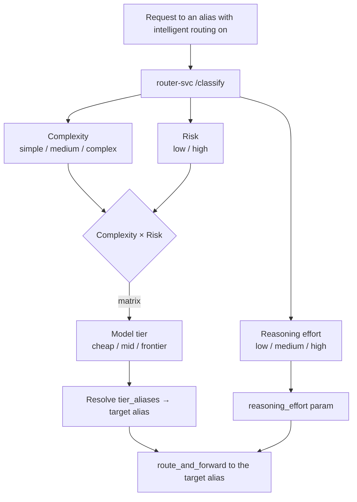

# Phase 4 — Intelligent Routing (Implementation Plan)

> Status: **DRAFT for discussion** · Parent spec: [`SPEC-AND-ROADMAP.md`](./SPEC-AND-ROADMAP.md) · Last updated: 2026-07-28

Today RunLedger routes by **priority** (and its `complexity_based` policy is a `chars/4` heuristic).
Phase 4 makes routing understand *the request*: **complexity × business risk → model tier**, plus a
**reasoning-effort** decision — so simple/low-risk work goes to a cheap model and only hard/high-risk
work reaches a frontier model (the PDF's 70/20/10 vs 100%-frontier shift).

## 1. Grounding (important)
`services/routing.py::select_route_with_policy` exists but is **not wired into the gateway hot path** —
`/chat/completions` uses priority-order `select_routes`. So Phase 4 adds intelligent routing as a **new
inline, per-route, fail-open stage** (same pattern as semantic cache / Context Compiler), *not* by
resurrecting the dormant policy engine. That engine can be unified later.

## 2. What it does



**Complexity × Risk → tier** (the PDF's matrix):

| | Risk low | Risk high |
|---|---|---|
| **Complexity low** | cheap | mid |
| **Complexity high** | mid | frontier |

So *"summarize this meeting"* → cheap; *"does this contract create regulatory exposure?"* → frontier,
even though the prompt looks short.

## 3. Architecture — dedicated `router-svc`
- Own container `runledger-router` (host port **8210**), CPU.
- `POST /classify { messages, config? }` → `{ complexity, risk, reasoning_effort, tier, reason, method }`.
- Two-pass classification (fail-open, hybrid):
  1. **Heuristic** (always): token estimate → complexity; a configurable **risk-keyword** scan
     (legal / regulatory / compliance / contract / financial / medical / security / PII …) → risk.
  2. **LLM refine** (optional): a local Ollama model zero-shot-labels `{complexity, risk,
     reasoning_effort}` as JSON; merged over the heuristic. Falls back to heuristic if unavailable.
- Maps complexity × risk → tier; reasoning_effort from the LLM or complexity.

## 4. Gateway integration (inline, per-route)
- New route fields **`intelligent_routing_enabled`** + **`routing_config`** (JSONB) — migration `046`,
  mirroring the compiler toggle. Plus a per-request `intelligent_routing` flag.
- `routing_config`:
  ```json
  {
    "tier_aliases": { "cheap": "gpt-4o-mini", "mid": "gpt-4o", "frontier": "o1" },
    "risk_keywords": ["regulatory", "contract", "compliance", "..."],
    "use_llm": true,
    "llm_model": "llama3.1:8b",
    "reasoning_effort": true
  }
  ```
- Flow: on a request to an alias with the toggle on → `router-svc /classify` → resolve
  `tier_aliases[tier]` → `route_and_forward` to that **target alias**, carrying `reasoning_effort`.
  `decision_reason` records the tier + why. **Fail-open**: any error → route the original alias normally.
- **Reasoning effort** becomes a real routing dimension: `reasoning_effort` is threaded through the
  payload builder to the provider (OpenAI reasoning models); `GatewayCompletionRequest` also accepts an
  explicit override.

## 5. Learning hook
Every routed request records `(tier, model, reasoning_effort, tokens, cost, decision_reason)` on the
`GatewayRequest`, so the Phase 7 flywheel can later learn the cheapest config that holds the quality SLA.

## 6. GUI (Gateway page)
- **Intelligent routing** toggle + inline **Routing ON/OFF** badge.
- Config popover: three **tier→model dropdowns** (cheap / mid / frontier, from `/providers/pricing`),
  a **use-LLM** toggle + **classifier model** dropdown (local models), a **risk-keywords** field, and a
  **reasoning-effort** toggle.

## 7. Deliverables
1. `router-svc` (heuristic + optional local-LLM classifier) + container + compose wiring.
2. Route fields `intelligent_routing_enabled` + `routing_config` (migration 046, model/schema/router).
3. Reasoning-effort threaded through `_build_payload` / `route_and_forward`; request-body override.
4. Client `services/intelligent_router.py` (fail-open) + gateway stage.
5. GUI (toggle, tier dropdowns, classifier config, reasoning-effort).
6. `examples/36_intelligent_routing.py` + Postman "Router Service" folder (via generator).
7. `docs/optimization/intelligent-routing.mdx` (per-feature doc) + nav; README capability; spec status → shipped.

## 8. Decisions — resolved 2026-07-28
1. ✅ **Classifier is user-configurable** — `classifier_mode`: `hybrid` | `llm` | `heuristic`, with a
   chosen `llm_model`, and a **configurable failure policy** (`on_failure`: `passthrough` = route the
   original alias, or a tier name = default tier).
2. ✅ **Reasoning-effort** is a routing dimension, threaded to the provider; per-request override too.
3. ✅ **Arbitrary N-tier map** — the operator defines any number of named `tiers` (name → alias) and a
   `matrix` mapping complexity × risk → tier name.

Final `routing_config`:
```json
{
  "classifier_mode": "hybrid",        // hybrid | llm | heuristic
  "llm_model": "llama3.1:8b",
  "risk_keywords": ["regulatory", "contract", "compliance", "..."],
  "complexity_thresholds": { "medium": 500, "complex": 2000 },   // heuristic token cutoffs
  "tiers": { "nano": "gpt-4o-mini", "mid": "gpt-4o", "frontier": "o1" },   // arbitrary N
  "matrix": {
    "simple":  { "low": "nano",     "high": "mid" },
    "medium":  { "low": "mid",      "high": "frontier" },
    "complex": { "low": "frontier", "high": "frontier" }
  },
  "reasoning_effort": true,
  "on_failure": "passthrough"         // passthrough | <tier name>
}
```
The GUI exposes classifier mode/model, reasoning-effort, on-failure, and risk keywords as controls, plus
a **Tiers & matrix (JSON)** textarea (consistent with the existing advanced-config field) so an arbitrary
tier map is editable without a bespoke matrix builder.

## 9. Out of scope (later)
- Unifying the dormant `routing.py` policy engine with this stage.
- Cost × quality flywheel that *learns* the tier map → Phase 7.
