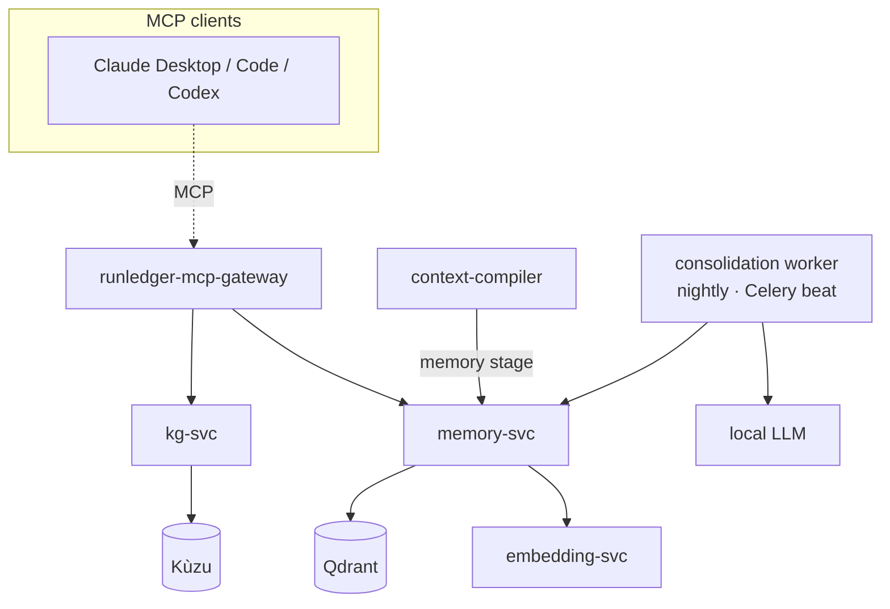

# Phase 5 — Cognitive / Memory Layer (Implementation Plan)

> Status: **DRAFT for discussion** · Parent spec: [`SPEC-AND-ROADMAP.md`](./SPEC-AND-ROADMAP.md) · Last updated: 2026-07-28

Phases 0–4 shrink and route a request. Phase 5 gives RunLedger **memory**: a shared cognitive layer of
persistent facts, a knowledge graph, and completed-task episodes — exposed over **MCP** to Claude
Desktop / Code / Codex / Cursor, and available to the Context Compiler so it can **assemble the smallest
useful context from memory** instead of dumping documents.

## 1. Architecture

Every store is **workspace/tenant-scoped** (same scope-isolation pattern as the semantic cache).

## 2. Services

### memory-svc (facts · preferences · decisions · episodes)
One service for all **typed memories** (a `kind`: `fact | preference | decision | episode`), rather than
four micro-services — simpler and they share storage/recall.
- Store: text + metadata → embedding-svc → **Qdrant** (a `memory` collection), scoped.
- `POST /memory` (upsert), `POST /recall {query, kind?, k}` (semantic top-k, scoped),
  `GET /memory` (list), `DELETE /memory/{id}`.
- Episodes are a `kind` with structured payload (goal, steps, artifacts, outcome).

### kg-svc (entities + relationships)
- **Kùzu** embedded graph DB. `POST /entities`, `POST /relations`, `POST /query` (Cypher),
  `GET /neighbors {entity}`. Scoped by workspace.
- v1 stores explicit entities/relations supplied via API (and by the consolidation worker); automatic
  entity extraction from memories is a follow-up.

### MCP tools (on runledger-mcp-gateway)
`memory_store`, `memory_recall`, `kg_add`, `kg_query`, `kg_neighbors` — so any MCP client shares the
same memory. (`compile_context` already exists.)

### Consolidation worker (nightly)
A Celery beat job: cluster/dedupe recent episodes → distilled `fact`/`decision` memories via the local
LLM; decay stale memories. Reuses the existing worker/beat.

## 3. Context Compiler integration
A new **`memory` stage** (early, before rerank): recall the top-k relevant facts/decisions for the
current question and inject a compact "Relevant memory" block. Opt-in per route
(`context_compiler_config.stages.memory` + `memory_k`), fail-open. This is the "assemble from memory"
direction the spec calls the center of gravity.

## 4. Deliverables
1. `memory-svc` (Qdrant-backed, scoped, typed memories + episodes) + container + compose.
2. `kg-svc` (Kùzu) + container + compose.
3. MCP tools on the MCP gateway.
4. Context Compiler `memory` stage (opt-in).
5. Consolidation worker (nightly).
6. `examples/37_memory.py`; Postman folders; `docs/optimization/memory.mdx` + nav; README + spec status.

## 5. Decisions — resolved 2026-07-28
1. ✅ **Wrap Letta** as the memory engine, on a **separate, dedicated database** for scale.
2. ✅ **Everything at once** — memory-svc + KG + skill registry + consolidation worker + compiler memory stage + MCP tools.
3. ✅ **Kùzu** for the knowledge graph, as planned.

### Service & database naming (distinct from the control plane)
| Container | Role | Notes |
|---|---|---|
| `runledger-postgres` | Control-plane DB (existing) | Plain Postgres 16 — metering, budgets, routes, etc. |
| `runledger-memory-db` | **Memory DB (NEW)** | Postgres + **pgvector**, dedicated to Letta — separate for scale. |
| `runledger-letta` | Letta server (NEW) | Points at `runledger-memory-db` + host Ollama (LLM + `nomic-embed-text` embeddings). |
| `runledger-memory-svc` | Memory wrapper (NEW, :8211) | Scoped store/recall over the Letta REST API (agent-per-workspace archival memory). |
| `runledger-kg-svc` | Knowledge graph (NEW, :8212) | Embedded **Kùzu**. |
| `runledger-skill-registry` | Skill registry (NEW, :8213) | Versioned skills (Anthropic Skills format). |

Letta wrapping approach: `memory-svc` maps each workspace to a Letta agent (named `ws-<workspace_id>`),
stores typed memories as archival-memory passages, and recalls by archival search — presenting a clean,
scope-isolated `store` / `recall` API to the MCP tools and the Context Compiler. Fail-open throughout.
