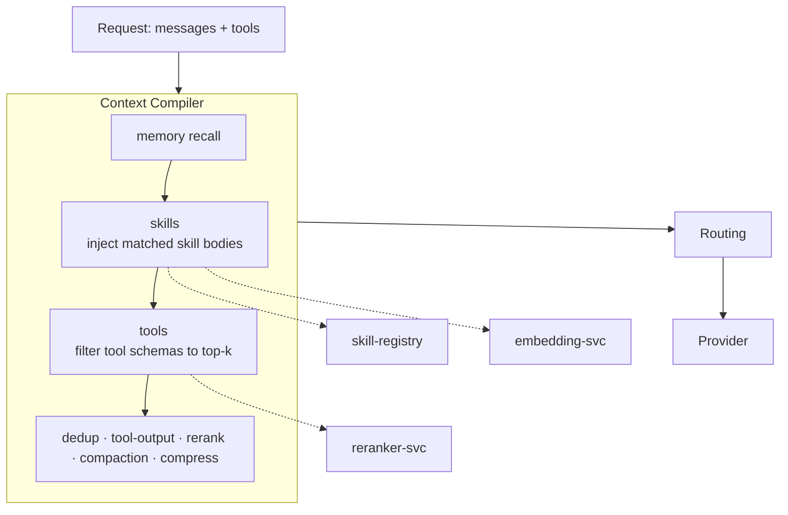

# Phase 6 — Dynamic Tool Filtering + Skill Injection (Implementation Plan)

> Status: **DRAFT for discussion** · Parent spec: [`SPEC-AND-ROADMAP.md`](./SPEC-AND-ROADMAP.md) · Last updated: 2026-07-28

Phase 6 is two sides of the same idea — **give the model only what's relevant to *this* request**:

1. **Dynamic tool filtering** — an agent with 150 MCP tools ships huge tool schemas on every call. Keep
   only the tools relevant to the current request.
2. **Skill injection** *(folded in)* — pull the *procedural knowledge* relevant to the request from the
   `skill-registry` and inject the matched skill's **body** (inject-body-on-match), provider-agnostically.

Both are new **Context Compiler stages** — opt-in, fail-open, quality-gated — reusing the `reranker-svc`,
`embedding-svc`, and `skill-registry` we already ship. No new datastore.

## Architecture

The compiler already receives `messages`, `workspace`, and `config`; Phase 6 also passes the request's
**`tools`** array through `/compile` and returns a **filtered `tools`** array.

## 1. Dynamic tool filtering (compiler `tools` stage)

- Rerank each tool's `name + description` against the current question (via `reranker-svc`); keep the
  **top-k** most relevant tools, drop the rest. Only engages when the tool count exceeds a threshold.
- **Never drop** a configured keep-list (`always_tools`) or a tool the latest assistant turn is already
  mid-calling.
- Config (in `context_compiler_config`): `stages.tools`, `tool_k` (default 8), `tool_min_score`,
  `always_tools: []`, `tool_filter_threshold` (min tool count to engage, default 12).
- Emits the tool-token delta into the `token_report` (tool schemas are large — this is a real win).

## 2. Skill injection (compiler `skills` stage, inject-body-on-match)

- Recall workspace skills from `skill-registry` (`GET /skills`), embed their descriptions via
  `embedding-svc`, rank against the question.
- For skills scoring **above `skill_min_score`**, inject the **full skill body** (inject-body-on-match)
  as a compact system block: `Relevant skill — <name>:\n<content>`. Capped at `skill_k` (default 2) to
  stay token-aware.
- Config: `stages.skills` (opt-in, default off), `skill_k`, `skill_min_score`.
- Scoped by `workspace` (already threaded for the memory stage).

> Executable/resource skills stay **agent/directory-scoped** — the gateway injects *procedural knowledge*
> (the `SKILL.md` body), not runnable scripts. Those remain served via the MCP tools.

## 3. MCP surface (Lane B)
- Add a **`select_tools(query, tools)`** tool on `runledger-mcp-gateway` that returns the relevant tool
  subset (same reranker path) — so MCP clients can pre-filter a large catalog before a call.
- (The cognitive tools `skill_list` / `skill_get` from Phase 5 already expose skills to MCP clients.)

## 4. Gateway integration
- Thread the request's `tools` through `context_compiler.compile_messages(...)` → `/compile`, and use the
  **returned filtered tools** for `route_and_forward` / `stream_request`. Fail-open: on any error the
  original tools + messages pass through unchanged.

## 5. GUI (Gateway page, compiler config popover)
Add to the Context Compiler config: **Tool filtering** toggle + `tool_k` + engage threshold; **Skill
injection** toggle + `skill_k` + min score. (Same popover as the existing compiler stages.)

## 6. Deliverables
1. Context Compiler `tools` + `skills` stages (+ config), `tools` in the `/compile` request/response.
2. Gateway threads `tools` through the compiler and uses the filtered set.
3. MCP `select_tools` tool.
4. GUI toggles for both stages.
5. `examples/38_tool_filtering_skills.py`; Postman requests; `docs/optimization/tool-filtering.mdx`
   (per-feature page + mermaid) + nav; README capability; spec/roadmap → Phase 6 shipped.

## 7. Decisions — resolved 2026-07-28
1. ✅ **Skill injection = inject-body-on-match** (not descriptions-only), capped at `skill_k`, above a score threshold.
2. ✅ **Both capabilities fold into Phase 6.**
3. ✅ **Tool-filter defaults:** `tool_k = 8`, engage when the request carries **> 12** tools (both configurable per route).
4. ✅ **Rank tools on name + description** (parameter schemas excluded from ranking, kept in the forwarded tool).

## 8. Out of scope (later)
- Aggregating multiple upstream MCP servers behind the gateway (Bifrost-style proxy) → future; v1 filters the tools already present on the request / passed to `select_tools`.
- Cost × quality flywheel → Phase 7.
