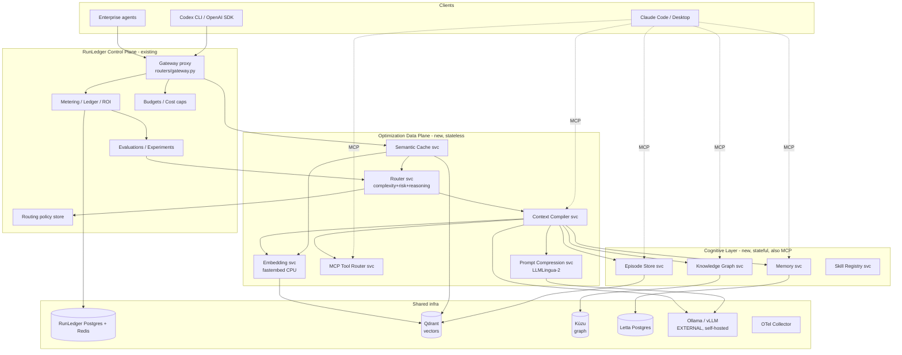
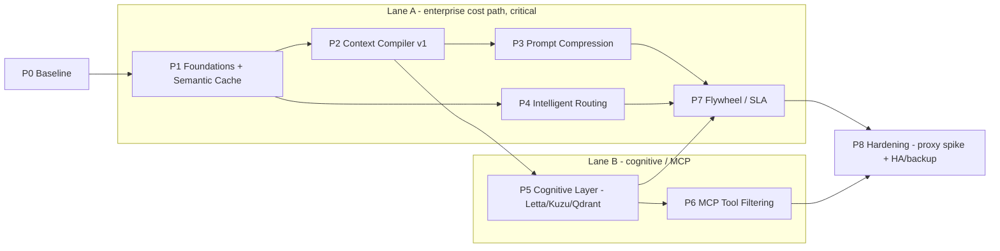

# RunLedger Optimization Layer — Spec & Roadmap

> Status: **DRAFT for discussion** · Owner: Abijith · Last updated: 2026-07-27
>
> This document turns the *Token Usage Optimization* gap analysis (see `Token Usage Optimization.pdf`)
> and the follow-on "cognitive/augmentation layer" discussion into a concrete, phased engineering
> spec. It is deliberately **implementation-agnostic on details** — we agree the architecture and
> sequencing here first, then write a per-phase implementation plan.
>
> **Decisions locked (2026-07-27):**
> 1. **Strict-parallel tracks** — inline gateway pipeline (Track A) *and* MCP augmentation (Track B) funded from the start.
> 2. **Dedicated datastores now** — Qdrant for vectors, Kùzu for the knowledge graph (Neo4j only with license sign-off). No pgvector/AGE.
> 3. **Wrap Letta (MemGPT)** for the memory engine.
> 4. **Primary user = the enterprise buyer** ("our token spend is exploding") — roadmap weighted toward hard, measured cost deltas and the cost×quality SLA flywheel.

---

## 1. Positioning: what we are building

RunLedger today answers:

> *"Where is my AI money going, and how do I control it?"*

We want it to additionally answer:

> *"How do I avoid consuming those tokens in the first place — without dropping below a quality/outcome SLA?"*

Restated as the product thesis:

> **Not an LLM gateway that happens to measure cost — a gateway (and cognitive layer) whose job is to
> minimize cost while preserving a customer-defined quality/outcome SLA.**

Two hard constraints, both from you:

1. **No local GPU dependency.** Every helper must run on CPU (ONNX / small BERT / quantized local models via Ollama are fine; anything needing a GPU is out of scope for the default deployment).
2. **Leverage open source as *helper microservices* rather than reinvent.** Each capability that a mature, appropriately-licensed OSS project already solves gets *wrapped*, not rebuilt. We own the orchestration and the FinOps/measurement glue; we borrow the algorithms.

Everything is **containerized** and each optimization capability is an **independently scalable service**.

---

## 2. Current state (grounded in the code, not the README)

What already exists in this repo and is genuinely strong — we build **on** it, we do not replace it:

| Area | Where it lives | Notes |
|---|---|---|
| OpenAI-compatible gateway | `apps/api/runledger_api/routers/gateway.py` | Pipeline is: cache lookup → route select → cost-cap/rpm controls → PII redact → forward (retry+fallback) → store cache → record `GatewayRequest`. |
| Exact prompt cache | `services/gateway.py` (`make_cache_key`, `check_cache`, `store_cache`) | SHA-256 of `{model, messages}`, workspace-scoped, 24h TTL. **Exact only.** |
| Routing policy engine | `services/routing.py` | Already has `cost_optimized`, `latency_optimized`, `quality_optimized`, `weighted`, `canary`, `budget_aware`, **`complexity_based`**, `outcome_optimized`. |
| Complexity routing (basic) | `routing.py::_complexity_based` | Heuristic: `chars/4` token estimate vs a threshold → simple/complex alias. This is the seed we upgrade, not a blank slate. |
| Budgets / cost caps | `services/budgets.py`, `gateway_controls.py` | Daily/monthly USD caps per route, per-user RPM. |
| Metering & pricing | `workers/metering.py`, `services/pricing.py`, `config/pricing.yml` | Token accounting incl. cached tokens; cost enrichment via Celery. |
| Evaluations / experiments | `routers/evaluations.py`, `eval_experiments.py`, `services/evaluators.py` | Quality scoring + experiment scaffolding. |
| Outcome / ROI ledger | `routers/outcomes.py`, `models/outcomes.py` | cost-per-success, ROI by workflow. **This is the differentiator the flywheel plugs into.** |
| Domain model | `models/` | `AgentRun → Span → ProviderCall / ToolCall`. Ideal shape for optimization analytics. |
| Async workers | Celery `worker` + `beat` | `docker-compose`/`infra/docker-compose.yml`. We reuse this for consolidation/flywheel jobs. |
| Deploy | `infra/` (compose + helm) | Postgres 16, Redis 7, `api`, `worker`, `beat`, `web`, OTel collector. |

**Gap in one line (from the PDF):** RunLedger receives an 80K-token request, meters/budgets/routes/records
it — but it never tries to *make it a 25K-token request first*, and its routing is cost/threshold-based
rather than complexity/risk/outcome-based.

---

## 3. The gaps (from the PDF), consolidated

The PDF's 10 prioritized gaps, regrouped into the three module families it proposes
(**Request Optimizer**, **Context Compiler**, **Execution Planner**) plus the **Flywheel**:

| # | Gap | Family | Verdict in repo today |
|---|---|---|---|
| 1 | Semantic cache | Request Optimizer | ❌ exact-only |
| 2 | Complexity router | Execution Planner | ⚠️ basic heuristic |
| 3 | Risk-based routing | Execution Planner | ❌ |
| 4 | Reasoning-effort router | Execution Planner | ❌ |
| 5 | Conversation compaction | Context Compiler | ❌ |
| 6 | RAG / context pruning | Context Compiler | ❌ |
| 7 | Tool-output compression | Context Compiler | ❌ |
| 8 | Prompt/context compression | Context Compiler | ❌ |
| 9 | MCP dynamic tool filtering | Context Compiler | ❌ |
| 10 | Cost × quality auto-optimization (flywheel) | Flywheel | ❌ (data exists, loop doesn't) |
| + | Agent-loop / execution budget | Execution Planner | ⚠️ spend guardrails only |

And the **cognitive layer** from the follow-on discussion adds a fourth family — the *source* of
high-value, low-token context that the Context Compiler assembles from:

| Layer | Purpose |
|---|---|
| Skill Registry | Reusable procedural knowledge (Anthropic Skills format) |
| Persistent Memory | Facts, preferences, decisions (not documents) |
| Knowledge Graph | Entities + relationships |
| Episode Store | Completed tasks → reusable solutions |
| Consolidation | Nightly episodic → semantic memory compaction |

The unifying insight both documents reach independently: **the Context Compiler is the center of gravity.**
The PDF wants it to *prune/compress* an oversized request; the cognitive-layer discussion wants it to
*assemble the smallest useful request* from memory. Same component, two directions — it sits between
the model and everything else.

---

## 4. Target architecture

### 4.1 Principles

- **RunLedger stays the control plane** — metering, budgets, routing-policy store, evals, outcome/ROI, RBAC, OTel. It orchestrates; it does not embed the heavy algorithms.
- **Optimization is a data plane of stateless helper services** behind the gateway, each wrapping one OSS capability, each independently scalable.
- **The cognitive layer is a set of stateful services** exposed *both* to the inline pipeline *and* over **MCP** to Claude Desktop / Claude Code / Codex / Cursor — so memory is shared across every client.
- **Dedicated, purpose-built datastores** (decision #2): **Qdrant** for all vector surfaces (semantic cache, episode store, RAG), **Kùzu** for the knowledge graph, **Letta's own Postgres** for its managed memory. The existing RunLedger Postgres/Redis remain for control-plane + queue. This is more infra to run and secure from day one, chosen for scale/isolation over the single-datastore shortcut.
- **Two integration modes funded in parallel** (decision #1), both sharing the Context Compiler, cognitive stores, embedding service, and RunLedger measurement:
  - **Track A — Inline gateway pipeline** (for OpenAI-compatible / Codex **and Claude**): inference flows *through* RunLedger, so optimization is automatic and fully measured. **This is where the enterprise cost deltas come from** (decision #4) — prioritized for hard numbers. **Working assumption (decision #6): Claude Code inference routes through an Anthropic-compatible RunLedger proxy** — i.e. Lane A covers Claude too. This is *assumed* for planning; the verification spike is deferred to the end of the roadmap (P8). If the spike fails, Claude falls back to measured-via-MCP+OTel only.
  - **Track B — MCP augmentation** (for Claude Desktop/Code): memory + context tools are *offered* to Claude; measured via OTel + gateway. Delivers the shared-cognitive-layer story.

### 4.2 Service topology



### 4.3 Inline request pipeline (Track A)

Extends the current `gateway.py` flow. **New stages in bold.**

```
REQUEST
  │
  ▼
Auth + budget precheck            (existing)
  │
Exact cache                       (existing)
  │
**Semantic cache**                (new · scope-aware)
  │
**Task classifier**               (new · complexity + risk + intent)
  │
**Context Compiler**              (new)
   ├─ conversation compaction
   ├─ RAG rerank + prune
   ├─ tool-output compression
   ├─ dedup
   ├─ **memory / KG / episode fetch**   (cognitive layer)
   ├─ **MCP tool filtering**
   └─ prompt compression (LLMLingua-2)  → token-budget report
  │
**Execution planner**             (new · model + reasoning_effort + tool set + max iters + cost ceiling)
  │
Route + forward (retry/fallback)  (existing)
  │
Metering / ledger / ROI           (existing)
  │
Eval + outcome                    (existing)
  │
**Flywheel learning loop**        (new · offline)
```

Every new stage is **fail-open and individually toggleable per workspace/route** (a config flag on the
route or policy), so we can ship them dark, A/B them, and roll back instantly. Nothing in the optimizer
path may ever turn a would-be-successful call into a failure.

---

## 5. Open-source leverage matrix

We wrap these rather than build. **Licenses must be re-verified at adoption time** — several of these
projects have changed license before (Redis modules, some memory projects) — but as of this draft:

| Capability | Primary OSS choice | License | CPU-only? | How we use it |
|---|---|---|---|---|
| Embeddings | **fastembed** (Qdrant) | Apache-2.0 | ✅ ONNX | One shared Embedding svc; also `sentence-transformers`/BGE as fallback |
| Semantic cache | **GPTCache** | MIT | ✅ | Wrap as Semantic Cache svc; back with **Qdrant** + scope keys |
| Vector store | **Qdrant** *(decision #2)* | Apache-2.0 | ✅ | Dedicated store for all vector surfaces: semantic cache, episode store, RAG |
| Reranking / RAG prune | **FlashRank** / BGE-reranker | Apache-2.0 / MIT | ✅ | Cross-encoder rerank + relevance-threshold prune in Context Compiler |
| Prompt compression | **LLMLingua-2** (Microsoft) | MIT | ✅ (small BERT) | Dedicated Prompt Compression svc |
| Complexity/semantic routing | **RouteLLM** (LMSYS) / **vLLM Semantic Router** | Apache-2.0 | ✅ (classifier) | Seed the Router svc; train on RunLedger eval/outcome data |
| Knowledge graph | **Kùzu** *(decision #2)* | MIT | ✅ | Dedicated embedded graph DB, run as the KG svc's store; **Neo4j only with license sign-off** |
| Persistent memory | **Letta (MemGPT)** *(decision #3)* | Apache-2.0 | ✅ | Wrap as Memory svc (facts/prefs/decisions + agent memory); expose via MCP. Letta manages its own Postgres. |
| Local model runtime | **Ollama / vLLM** (external, self-hosted) | MIT / Apache-2.0 | ✅ | Summarization, compaction, consolidation, judge. Not shipped in the suite — RunLedger points at `OLLAMA_BASE_URL`/`VLLM_BASE_URL`. |
| MCP framework | **FastMCP** / MCP Python SDK | Apache-2.0 / MIT | ✅ | Expose cognitive + compiler services as MCP tools |
| Flywheel concepts | **TensorZero** (reference only) | Apache-2.0 | — | Borrow the inference→feedback→optimization loop design; build our own on RunLedger data |

**Flagged — avoid or isolate (licensing / infra):**

- **Basic Memory** — AGPL-3.0 (copyleft). Use as a *reference design* only; do not embed.
- **Neo4j Community** — GPLv3. We chose **Kùzu (MIT)** for the graph. Neo4j only if we later need its ecosystem, run as a separate network service (no linking) with recorded sign-off.
- **Redis Stack / RediSearch vector** — SSPL/RSALv2. Do **not** adopt for vector search; **Qdrant** owns vectors. Plain `redis:7-alpine` (already in the stack) stays for cache/queue only.
- **Letta license watch** — Letta core is Apache-2.0; verify no server component ships under a non-permissive license at adoption, and keep our wrapper talking to it over its API (no source linking).
- Any HF model weights: check the *model card* license separately from the library (BGE = MIT, but verify per-model).

**License policy for the whole layer:** permissive only (Apache-2.0 / MIT / BSD / PostgreSQL) for anything
we link into our process. Copyleft (AGPL/GPL) allowed **only** as a standalone network service reached over
a documented API, and only with explicit approval recorded in `docs/optimization/licensing.md` (to be created).

---

## 6. Service catalog

Each is its own container, its own repo-package under `apps/` or `services/`, its own health check, and
horizontally scalable unless noted. API style: internal **HTTP+JSON** first (simplest to debug and to call
from the existing async FastAPI), with a path to gRPC for the hot ones (cache, embed, compiler) if latency
demands it.

1. **Embedding svc** — `POST /embed` → vectors. fastembed ONNX, CPU. Stateless, scales wide. Shared by cache/memory/KG/episodes/RAG so there's one embedding model version of record.
2. **Semantic Cache svc** — `POST /lookup {embedding, scope}` → hit|miss+payload; `POST /store`. Backed by **Qdrant**. **Scope key = {tenant, model, system-prompt hash, knowledge-version, security-scope, TTL}** so cache hits can never leak across permission boundaries (the PDF's explicit warning). Similarity threshold configurable (default ≥0.95).
3. **Router svc** — `POST /route {request, task-meta}` → `{model_tier, reasoning_effort, tool_scope, cost_ceiling, reason}`. Complexity score + risk score + intent. Learns from RunLedger eval/outcome. Feeds/extends the existing `complexity_based` policy rather than replacing `routing.py`.
4. **Context Compiler svc** — `POST /compile {raw_context, budget, scope}` → `{compiled_context, token_report, dropped[]}`. Orchestrates compaction, rerank/prune, dedup, tool-output compression, cognitive fetch, tool filtering, and prompt compression. **The crown jewel.**
5. **Prompt Compression svc** — `POST /compress {text, ratio, protect[]}` → compressed text + stats. LLMLingua-2. Split out because it's the most CPU-heavy stage and scales independently.
6. **MCP Tool Router svc** — aggregates upstream MCP servers; `POST /select-tools {intent}` → minimal tool schema subset (Bifrost-style filtering/namespacing) instead of shipping 150 tool defs every turn.
7. **Memory svc** — facts / preferences / decisions. CRUD + semantic recall. **Letta-backed** (its own Postgres). MCP-exposed.
8. **Knowledge Graph svc** — entities + relationships; Cypher queries over **Kùzu**. MCP-exposed.
9. **Episode Store svc** — completed-task episodes (goal, steps, artifacts, outcome); retrieval by similarity. **Qdrant**. MCP-exposed.
10. **Skill Registry svc** — versioned Anthropic-Skills-format store; serves skill metadata to clients and to the compiler.
11. **Consolidation worker** — nightly Celery beat job: episodic → consolidated semantic memory, dedupe, decay. Uses Ollama.
12. **Flywheel svc** — offline: over RunLedger's `(config, cost, quality, outcome)` tuples, compute the cheapest configuration that holds the quality SLA, publish routing recommendations back to the Router svc / policy store.

State ownership (decision #2 — dedicated stores): Semantic Cache + Episode Store → **Qdrant**; Knowledge
Graph → **Kùzu**; Memory → **Letta's Postgres**; Skill Registry → files + a small table in RunLedger
Postgres. Everything else is stateless. Each store is its own container with its own backup/retention policy.

---

## 7. Cross-cutting concerns

- **Quality floor is a first-class guardrail.** No optimization ships without an eval gate: every stage is measured on the RunLedger eval harness and auto-disabled per-workspace if success-rate drops below the configured SLA. "Cost reduction *subject to* a quality floor" is the invariant, per the PDF.
- **Fail-open everywhere.** Optimizer service down / slow / erroring ⇒ pass the original request through unmodified and record a degraded-mode flag. Optimization must never be on the critical path for correctness.
- **Semantic-cache safety.** Scope keys (tenant, permissions, knowledge version, model, system prompt, security scope) are mandatory. A cross-scope hit is a security bug, not a cache miss.
- **Memory tenancy.** Cognitive stores are workspace/tenant-scoped with the same RBAC as the rest of RunLedger; MCP exposure must carry the caller's identity.
- **Observability.** Every stage emits OTel spans nested under the existing `AgentRun → Span` model, with a `token_report` (before/after tokens per stage) so savings are attributable per stage — this is what makes the phase-by-phase benchmark real.
- **No-GPU invariant** is enforced in CI (container images must build and pass on CPU runners).
- **Config surface.** Per-route/per-workspace toggles for each stage, thresholds (similarity, compression ratio, prune relevance, complexity cutoffs), and the quality SLA — stored alongside routing policies.

---

## 8. Phased roadmap

Sequencing reflects the locked decisions: **strict-parallel tracks** (Track A inline + Track B MCP both
funded from the start) and an **enterprise-buyer weighting** — the critical path is the one that produces
hard, measured cost deltas (inline pipeline + semantic cache + Context Compiler + flywheel). Each phase is
independently shippable, containerized, and measured against the Phase 0 baseline.

> **Two swim-lanes run concurrently after Phase 1:**
> - **Lane A (enterprise cost path, critical):** P0 → P1 → **P2 Context Compiler inline** → P3 compression → P4 routing → **P7 flywheel/SLA**. This is what the "token spend is exploding" buyer pays for.
> - **Lane B (cognitive/MCP path):** P1 MCP scaffolding → **P5 cognitive layer (Letta/Kùzu/Qdrant)** → P6 tool filtering, exposing the same Context Compiler + memory over MCP to Claude Desktop/Code.
> The two lanes converge at the Context Compiler (shared) and at RunLedger measurement. Enterprise weighting
> means Lane A gets first claim on shared capacity when the two compete.

### Phase 0 — Baseline & benchmark harness
**Goal:** make savings measurable before optimizing anything.
- Route Codex CLI + Claude Code through RunLedger; confirm `/chat/completions` and (spike) `/responses` + Anthropic-proxy behavior.
- Define the standard benchmark task (the PDF's "analyze this repo / find security issues / write report").
- Dashboards for: input / cached / output tokens, agent calls, cost, task success, latency.
- **Exit:** a reproducible Baseline vs Optimized comparison table wired to real runs.
- **Deps:** none (uses existing RunLedger).

### Phase 1 — Shared foundations
**Goal:** the substrate both lanes need.
- Embedding svc (fastembed, CPU) + container.
- Stand up dedicated stores: **Qdrant** (vectors), **Kùzu** (graph), and Letta's Postgres — single-instance containers with healthchecks. **No HA, no backup/restore yet** (decision #10 — deferred to P8); local volumes are fine for now.
- **Semantic Cache svc** (Qdrant-backed) with scope-aware keys (PDF gap #1) — the fastest standalone token win, on Lane A's critical path.
- MCP scaffolding (FastMCP) — an empty but wired MCP server clients can attach to (Lane B kickoff).
- Point RunLedger at the external local-LLM endpoint(s) (`OLLAMA_BASE_URL`/`VLLM_BASE_URL`) for later optimizer stages — no local-LLM container in the suite.
- **Exit:** semantic cache measurably lifts hit-rate over exact cache on the benchmark; MCP server reachable from Claude Desktop; all dedicated stores green in compose.
- **Deps:** Phase 0.

### Phase 2 — Context Compiler v1 (prune & rerank)
**Goal:** the biggest token win in the PDF. Enterprise weighting → build **inline (Lane A) first**, expose the same service over MCP (Lane B) in the same phase.
- Conversation compaction (checkpoint → goal/decisions/facts/artifacts/pending).
- RAG rerank + relevance-threshold prune (FlashRank/BGE).
- Dedup + tool-output compression (rules + small Ollama model).
- `token_report` per stage into OTel.
- **Exit:** demonstrated input-token reduction on the benchmark with success-rate held, in the inline pipeline; same service reachable as an MCP tool from Claude Code.
- **Deps:** Phase 1 (embed, Qdrant, Ollama, MCP).

### Phase 3 — Prompt compression
**Goal:** squeeze the compiled context further under a quality floor.
- Prompt Compression svc (LLMLingua-2), protected-span support.
- Wire into Context Compiler as the final stage; quality-gate it.
- **Exit:** additional reduction with eval-verified quality hold; auto-disable on SLA breach proven.
- **Deps:** Phase 2, eval harness.

### Phase 4 — Intelligent routing (complexity + risk + reasoning-effort)
**Goal:** upgrade `complexity_based` from `chars/4` to a real classifier, add risk + reasoning-effort.
- Router svc (RouteLLM-seeded) → model tier + reasoning_effort + cost ceiling.
- Integrate as a new/extended `routing.py` policy; keep priority fallback.
- Reasoning-effort as an explicit routing dimension; record `(task, model, effort, tokens, cost, quality)`.
- **Exit:** measured cost shift toward cheaper tiers at held quality (PDF's 70/20/10 vs 100% frontier).
- **Deps:** Phase 0 data; benefits from Phase 7 loop later.

### Phase 5 — Cognitive / memory layer (Lane B core)
**Goal:** the shared cognitive substrate across Claude Desktop/Code/Codex/Cursor.
- Memory svc (**Letta**), Knowledge Graph svc (**Kùzu**), Episode Store svc (**Qdrant**), Skill Registry svc.
- Consolidation worker (nightly, Ollama).
- All exposed over MCP; Context Compiler now *pulls* minimal facts/decisions/episodes instead of dumping documents.
- **Exit:** Claude gets task-relevant minimal context from memory; cross-client shared memory demonstrated.
- **Deps:** Phase 1 (embed, MCP, Qdrant, Kùzu, Letta), Phase 2 (compiler). Runs concurrently with Lane A phases 3–4.

### Phase 6 — MCP dynamic tool filtering
**Goal:** stop shipping the full tool catalog every turn.
- MCP Tool Router svc: intent → minimal tool subset (PDF gap #9).
- **Exit:** measured tool-schema token reduction on multi-MCP agent runs.
- **Deps:** Phase 5 (MCP layer), Router svc intent signal.

### Phase 7 — Optimization flywheel (cost × quality SLA)
**Goal:** the differentiator — auto-pick the cheapest config that holds the SLA.
- Flywheel svc over RunLedger `(config, cost, quality, outcome)` tuples → recommendations to Router/policy store.
- Customer sets `min_quality`; system selects config (the PDF's Claude-Mid-over-Frontier-Low example).
- **Exit:** closed loop — recommendations auto-applied (or approval-gated) and shown to move cost down at held quality.
- **Deps:** Phases 3–5 (enough signal), eval/outcome data.

### Phase 8 — Hardening: proxy spike + HA/backup (deferred)
**Goal:** validate the assumptions we deliberately deferred, and make the multi-store stack production-grade.
- **Claude inference-through-proxy spike** (decision #6): confirm Claude Code inference actually flows through the Anthropic-compatible RunLedger proxy. If it fails, formalize the MCP+OTel-measured fallback for Claude (Lane A stays OpenAI/Codex-only for full inline optimization).
- **HA + backup/restore** for all stateful stores (decision #10): Qdrant, Kùzu, Letta-Postgres, RunLedger-Postgres, Redis — consolidated backup/retention + failover story wired into `infra/` (compose + helm).
- **Exit:** proxy behavior known for certain; documented, tested backup/restore + HA path for every store.
- **Deps:** everything (this is the productionization pass).

### Sequencing at a glance



---

## 9. Success metrics (per the PDF's harness)

Tracked as Baseline vs Optimized on the standard benchmark, every phase:

| Metric | Baseline | Target trend |
|---|---|---|
| Input tokens | e.g. 284K | ↓↓ (Context Compiler + semantic cache) |
| Cached tokens | 142K | ↑ effective reuse |
| Output / reasoning tokens | 31K | ↓ (reasoning-effort routing) |
| Agent calls | 17 | ↓ (compaction, tool filtering) |
| Cost / task | $2.84 | ↓↓ |
| **Task success** | 96% | **held ≥ SLA** (hard gate) |
| Latency | 91s | ↓ or neutral |

Headline metric: **cost reduction subject to a quality floor.**

---

## 10. Decisions & remaining open questions

**Resolved 2026-07-27:**

1. ✅ **Tracks:** strict-parallel — Lane A (inline) and Lane B (MCP) both funded; enterprise weighting gives Lane A first claim on shared capacity.
2. ✅ **Vector store:** dedicated **Qdrant** from day one (not pgvector).
3. ✅ **Knowledge graph:** **Kùzu** (Neo4j only with license sign-off).
4. ✅ **Memory engine:** wrap **Letta (MemGPT)**.
5. ✅ **Primary user:** enterprise buyer → hard cost deltas + cost×quality SLA flywheel prioritized.
6. ✅ **Claude inference-through-proxy:** **assume proxy route** for all planning; Lane A covers Claude. Actual verification spike **deferred to Phase 8** (fallback = MCP+OTel-measured only if it fails).
7. ✅ **Multi-store HA/backup:** **not now** — single-instance stores, local volumes, no backup/HA through the main phases. Consolidated backup/restore + HA **deferred to Phase 8**.

**Still open — to settle during per-phase implementation planning:**

8. **Local model:** which Ollama model(s) for compaction/consolidation/judge on CPU (size vs quality trade-off)?
9. **Repo layout:** new services under `apps/` in this monorepo (shared tooling, one compose with profiles) vs separate repos. I lean monorepo.
10. **Inter-service transport:** HTTP+JSON everywhere first, or gRPC for the hot path (embed/cache/compiler) from the start? I lean HTTP-first, gRPC later where latency demands.

---

## Appendix A — mapping PDF gaps → phases → OSS

| PDF gap | Phase | OSS wrapped |
|---|---|---|
| Semantic cache | 1 | GPTCache + Qdrant + fastembed |
| Context/prompt compression | 2–3 | FlashRank, LLMLingua-2, Ollama |
| Conversation compaction | 2 | custom + Ollama |
| RAG pruning | 2 | FlashRank / BGE-reranker |
| Tool-output compression | 2 | rules + Ollama |
| Complexity + risk routing | 4 | RouteLLM / vLLM Semantic Router |
| Reasoning-effort routing | 4 | custom + RunLedger evals |
| Cognitive memory/KG/episodes | 5 | Letta, Kùzu, Qdrant, FastMCP |
| MCP dynamic tool filtering | 6 | MCP SDK + custom |
| Cost × quality flywheel | 7 | TensorZero (reference) + RunLedger data |
