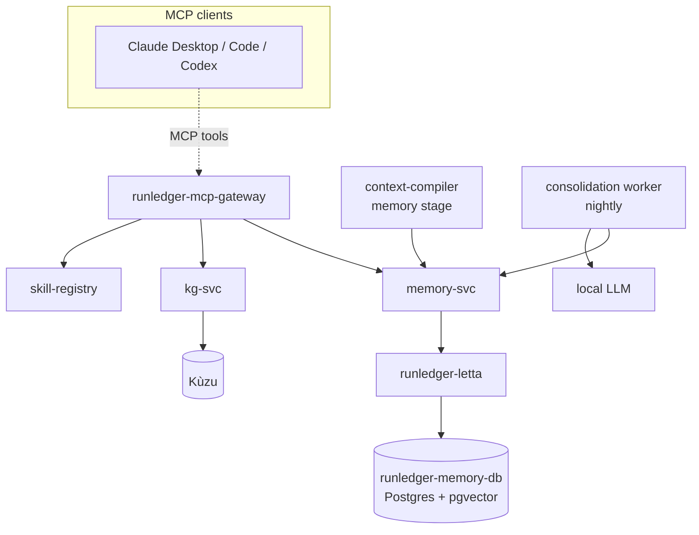

The cognitive layer gives RunLedger **memory**. Instead of every client re-sending the same context,
they draw on a shared, workspace-scoped store of **facts**, a **knowledge graph** of entities and
relationships, and a **skill registry** — and the Context Compiler can pull the minimal relevant facts
into a request instead of dumping documents.

## How it works



Everything is **workspace-scoped** (the same isolation model as the semantic cache), and every path is
**fail-open** — a client session is never broken by a downstream service being unavailable.

## Memory (Letta-backed)

Persistent, typed memories: `fact`, `preference`, `decision`, `episode`. Wraps **Letta (MemGPT)**: each
workspace maps to a Letta agent, memories are stored as archival-memory passages, and recall is a
semantic archival search.

- Runs against a **dedicated database** — `runledger-memory-db` (Postgres + **pgvector**) — kept
  **separate from the control-plane `runledger-postgres`** for independent scale.

<Note>
**Letta embedding provider.** Memory store/recall needs Letta to have a working **embedding model**.
Out of the box it uses `letta/letta-free` (Letta's hosted free inference — needs outbound internet).
To keep memory fully local, register a local embedding model with Letta and set
`LETTA_MODEL` / `LETTA_EMBEDDING` to those handles. The rest of the cognitive layer (knowledge graph,
skills, MCP tools, consolidation) is fully local and has no such dependency.
</Note>

```
POST /memory  { workspace, kind, text }        → store
POST /recall  { workspace, query, k }          → top-k relevant memories
```

## Knowledge graph (Kùzu)

An embedded **Kùzu** graph of entities + relationships, scoped by workspace — so you can ask what a
service depends on, who owns a component, or how facts connect.

```
POST /entities   { workspace, id, type, name }
POST /relations  { workspace, from_id, to_id, type }
GET  /neighbors  ?workspace=&entity=
```

## Skill registry

Versioned, reusable procedural knowledge (Anthropic Skills format: name + description + content),
file-backed per workspace. Clients list skills and fetch the ones relevant to a task.

## Consolidation

A nightly worker distils recent **episodes** into durable **facts/decisions** via the local LLM — so
memory stays compact and reusable instead of growing without bound, like human memory consolidation.

## Over MCP

All of it is exposed as MCP tools on the RunLedger MCP server, so **memory is shared across clients**:

`memory_store` · `memory_recall` · `kg_add_entity` · `kg_add_relation` · `kg_neighbors` ·
`skill_list` · `skill_get` (alongside `compile_context`).

## Context Compiler integration

An opt-in **memory stage** (`context_compiler_config.stages.memory` + `memory_k`) recalls the top-k
relevant facts for the current question and injects a compact "Relevant memory" block — the
*assemble-from-memory* direction, so the model gets the minimal facts it needs rather than a document dump.

## Services

| Service | Port | Role |
|---|---|---|
| `runledger-memory-svc` | 8211 | Scoped store/recall (Letta wrapper) |
| `runledger-letta` | 8214 | Letta server |
| `runledger-memory-db` | — | Postgres + pgvector (Letta's DB) |
| `runledger-kg-svc` | 8212 | Knowledge graph (Kùzu) |
| `runledger-skill-registry` | 8213 | Skill registry |

See [`examples/37_cognitive_layer.py`](https://github.com/avs6/runledger-community/blob/master/examples/37_cognitive_layer.py)
and the [overview](/optimization).
