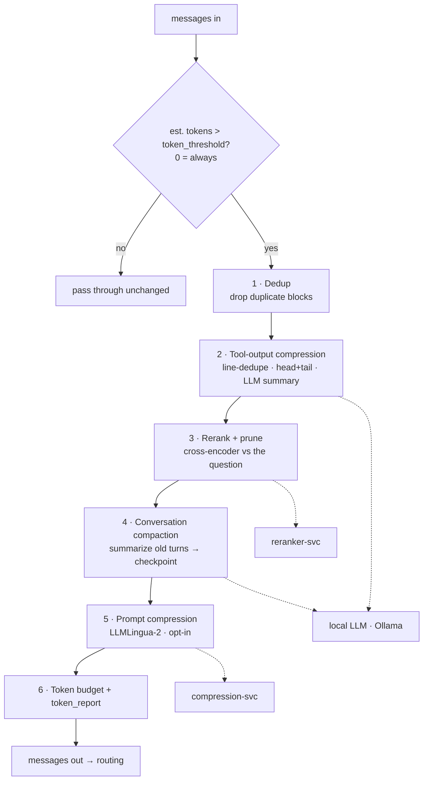

The Context Compiler is the single biggest token win: it intercepts an oversized `messages` array and
forwards a smaller, equivalent one — **without changing the reasoning model**. Every stage is
**opt-in, fail-open, and quality-gated**, and it only runs when a request exceeds a configurable size.

## How it works



It sits in the gateway **after the semantic-cache miss and before routing**, so both cache and compiler
get a chance before a provider call. Stages run in order; each is individually toggleable:

| Stage | What it does | Engine |
|---|---|---|
| **Dedup** | Removes exact-duplicate content blocks (agent loops that resend context). | hashing |
| **Tool-output compression** | Collapses `role: tool` / oversized messages — dedupe lines, head+tail truncation, or a local-LLM summary for very large outputs. | rules + local LLM |
| **Rerank + prune** | Splits bulk context into chunks, reranks them against the current question with a cross-encoder, and keeps the top chunks within a per-message budget. | `reranker-svc` |
| **Conversation compaction** | Summarizes older turns into a compact checkpoint (goal / decisions / facts / artifacts / pending) when over budget. | local LLM |
| **Prompt compression** | *(opt-in, lossy)* LLMLingua-2 token compression — see [Prompt Compression](/optimization/prompt-compression). | `compression-svc` |
| **Token budget** | Enforces the input ceiling and emits a `token_report` (before / after per stage). | — |

### Protected spans

Rerank, compaction, and compression **never touch** the final user question or the most recent turns
(`keep_recent`, default 4) or the first system message — only the *bulk middle context* is compressed.
This is why a short 2-turn conversation is left untouched, while a long agent transcript is shrunk hard.

### Fail-open & quality floor

Any stage that errors (or a downstream service that's down) is skipped, and the original content for that
stage passes through — the compiler can never turn a good request into a failure. Optimizations are
measured on the eval harness and can be disabled per route the moment quality regresses.

## Enabling it

- **Dashboard** → Gateway page → **Compiler ON/OFF** badge, with a config popover (compaction model,
  reranker model, engage threshold, and the compression sub-settings).
- **Per route** → `"context_compiler_enabled": true` + a `context_compiler_config`:

  ```json
  {
    "model": "llama3.1:8b",          // compaction / tool-summary LLM (local)
    "reranker_model": "flashrank",   // "flashrank" | "bge-reranker-base" | "jina-tiny"
    "token_threshold": 2000,         // 0 = always engage
    "token_budget": 32000,           // input ceiling after compile
    "keep_recent": 4,                // recent turns kept verbatim
    "stages": { "dedup": true, "tool_output": true, "rerank": true, "compaction": true, "compress": false }
  }
  ```

- **Per request** → `"context_compiler": true` in a `/gateway/chat/completions` body.
- **MCP** → the `compile_context` tool on the RunLedger MCP server (for Claude Desktop / Code).

## The token report

Every compiled request emits a `token_report` — `{ before, after, saved, per_stage }` — so savings are
attributable per stage. Example (a bloated request with a duplicated system prompt and a 400-line log):

```json
{ "before": 1967, "after": 103, "saved": 1864,
  "per_stage": { "dedup": 73, "tool_output": 1791, "rerank": 0, "compaction": 0 } }
```

Here dedup removed the duplicate system block and tool-output compression collapsed the log — a **95%**
reduction — while rerank/compaction correctly did nothing because the request was already under budget.

## Services

| Service | Port | Role |
|---|---|---|
| `runledger-context-compiler` | 8207 | Orchestrates the stages |
| `runledger-reranker` | 8208 | Cross-encoder rerank (MiniLM / BGE) |
| `runledger-compression` | 8209 | LLMLingua-2 (prompt compression stage) |
| local LLM (Ollama / vLLM) | external | Compaction & tool summaries |

See [`examples/34_context_compiler.py`](https://github.com/avs6/runledger-community/blob/master/examples/34_context_compiler.py)
and the [overview](/optimization).
