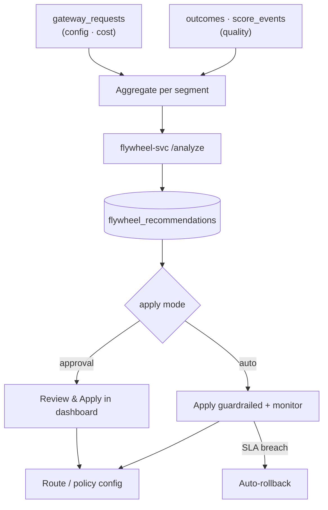

The optimization layer (Phases 1–6) gives you the *levers* — semantic cache, context compiler,
compression, routing, tool filtering. The **flywheel** is the loop that pulls them for you: it reads
how your own traffic actually performed under each configuration and finds, per segment, the
**cheapest configuration that still holds your quality SLA**.

The data already exists — RunLedger records it on every call. The flywheel is the part that learns
from it.

- **Cost + config** come from your gateway traffic (`gateway_requests`, stamped with the
  `config_fingerprint` each call ran under).
- **Quality** comes from your `outcomes` and `score_events`, attached at the model grain.
- Output is a set of **recommendations** you can review and apply — or let the flywheel apply
  automatically, guardrailed by the SLA.

## How it works

The analyzer is stateless. A nightly Celery beat job aggregates the tuples, calls `flywheel-svc`,
persists the recommendations, and — in `auto` mode — applies the safe ones and rolls back any that
later breach the SLA. Nothing runs unless the workspace opts in, and any failure aborts the run
without touching production config.

## Recommendation kinds

| Kind | When | What it proposes |
|---|---|---|
| **switch** | A cheaper config with enough data already holds the SLA | Move to it |
| **explore** | A cheaper config looks promising but is under-sampled | Canary it to gather data first |
| **guardrail** | The current (dominant) config is **below** the SLA | Move to the cheapest config that holds it |

Every recommendation carries the estimated cost delta, current vs proposed quality against the SLA,
the sample size, and a confidence (`high` / `medium` / `low`) based on how much data backs it.

## Configuration

All per-workspace, on the dashboard **Gateway → Optimization Flywheel** panel (or `PUT
/gateway/flywheel/settings`):

| Setting | Options | Notes |
|---|---|---|
| `apply_mode` | `approval` · `auto` · `off` | `approval` proposes only; `auto` applies guardrailed & auto-rolls-back; `off` analyzes without applying |
| `quality_metric` | `outcome_success` · `eval_score` · `blend` | You define what "quality" means; `blend` weights outcome success-rate with eval/judge scores |
| `min_quality` | 0–1 | The SLA floor every recommendation must hold |
| `segment_by` | `outcome_type` · `task_class` · `alias` | How traffic is grouped for "cheapest config per X" |
| `action_space` | `model` · `stages` · `compression_rate` · `cache_threshold` · `routing` | Which config dimensions the flywheel may change |
| `min_sample_size` | integer | Minimum observations before a config is trusted for a `switch` |

## Applying recommendations

Because recommendations are **observational**, applying is scoped for safety:

- **`alias`-segmented** recommendations map directly to a route — applying patches that alias's
  primary route (model swap, cache toggle, compiler stages, compression rate) and snapshots the
  prior config so a guardrail breach can roll it back.
- **`outcome_type` / `task_class`** segments don't map 1:1 to a single route, so they are
  **advisory**: accepting one records the decision without mutating routes. Auto-apply only ever
  touches `alias`-segmented recommendations.

<Note>
The quality floor is a first-class guardrail. No recommendation is applied — and nothing stays
applied — below the SLA. In `auto` mode, an applied config whose measured quality later drops below
`min_quality` is automatically rolled back to its snapshot.
</Note>

## MCP tool

The stateless analyzer is also exposed to MCP clients as **`flywheel_analyze(segments, …)`** — pass
your own per-segment `(config, n, avg_cost_per_req, quality)` observations and get back the cheapest
config per segment that holds the SLA.

## Endpoints

| Method | Path | Purpose |
|---|---|---|
| `GET` | `/gateway/flywheel/settings` | Current settings (creates defaults) |
| `PUT` | `/gateway/flywheel/settings` | Update SLA / metric / mode / segmentation |
| `GET` | `/gateway/flywheel/recommendations` | List recommendations (filter by `status`) |
| `POST` | `/gateway/flywheel/recommendations/{id}/apply` | Apply a pending recommendation |
| `POST` | `/gateway/flywheel/recommendations/{id}/dismiss` | Dismiss a pending recommendation |
| `POST` | `/gateway/flywheel/run` | Run the analysis loop now |

See [`examples/39_flywheel.py`](https://github.com/avs6/runledger-community/blob/master/examples/39_flywheel.py)
and the [overview](/optimization).
