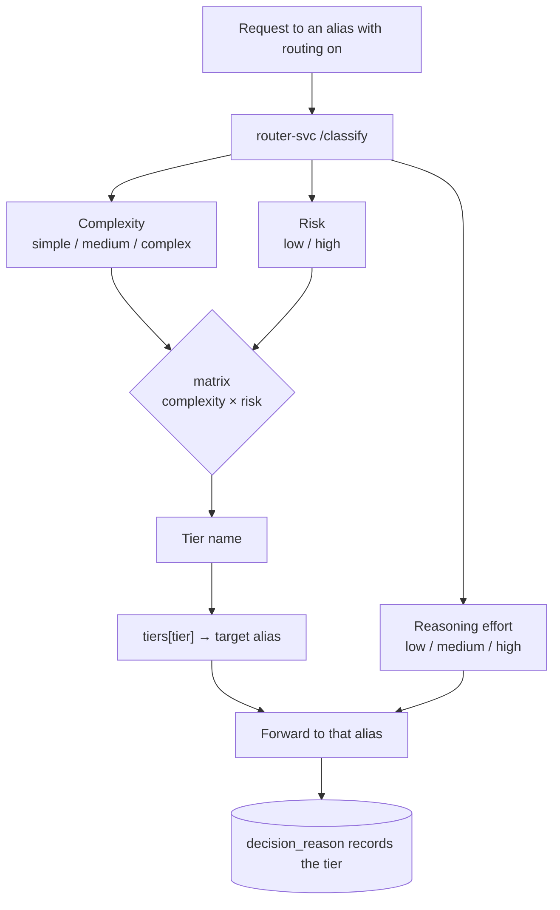

Priority routing always picks the same route. Intelligent routing understands *the request*: it
classifies **complexity** and **business risk**, maps them to a **model tier**, and picks a
**reasoning effort** — so a *"summarize this meeting"* goes to a cheap model while *"does this contract
create regulatory exposure?"* reaches a frontier model, even though the prompt looks short.

## How it works



It runs as an inline gateway stage inside `runledger-gateway-rs` after the semantic cache and Context Compiler. **Fail-open**: if the
classifier is unavailable, the request routes to the alias it was sent to (or a configured default tier).

The classification logic was previously hosted in a standalone `runledger-router` sidecar.
As of the sidecar collapse, it is now absorbed into the Rust data plane — the former sidecar
is deprecated and moved to the `deprecated` Docker Compose profile.

### Complexity × Risk → tier (default matrix)

| | Risk low | Risk high |
|---|---|---|
| **Complexity low** | cheap | mid |
| **Complexity high** | mid | frontier |

Tiers are an **arbitrary map** — you define any number of named tiers (`name → alias`) and the matrix
that maps each complexity × risk cell to a tier name.

## Classifier modes

Configurable per route via `classifier_mode`:

| Mode | Behaviour |
|---|---|
| `heuristic` | Token estimate → complexity; a configurable **risk-keyword** scan → risk. Deterministic, no LLM. |
| `llm` | A local Ollama model zero-shot-labels `{complexity, risk, reasoning_effort}`. Falls back to heuristic if the LLM is unavailable. |
| `hybrid` | Heuristic first, LLM refine merged on top. Default. |

## Reasoning effort

The router also decides `reasoning_effort` (low / medium / high). It's passed to the provider **only for
reasoning models** (OpenAI o-series) — other models never receive it, so routing to a `gpt-4o` or a local
model stays clean. You can also override it per request with `"reasoning_effort": "high"`.

## Configuration

```json
{
  "classifier_mode": "hybrid",        // hybrid | llm | heuristic
  "llm_model": "llama3.1:8b",
  "risk_keywords": ["regulatory", "contract", "compliance", "..."],
  "complexity_thresholds": { "medium": 500, "complex": 2000 },
  "tiers": { "cheap": "gpt-4o-mini", "mid": "gpt-4o", "frontier": "o1" },
  "matrix": {
    "simple":  { "low": "cheap",    "high": "mid" },
    "medium":  { "low": "mid",      "high": "frontier" },
    "complex": { "low": "frontier", "high": "frontier" }
  },
  "reasoning_effort": true,
  "on_failure": "passthrough"         // passthrough | <tier name>
}
```

Enable it via the dashboard Gateway page (**Routing ON/OFF** badge + a routing-config editor), a route's
`"intelligent_routing_enabled": true`, or per request with `"intelligent_routing": true`. Each routed
request records the decision (`complexity=… risk=… → tier=…`) on the `GatewayRequest`, which feeds the
future cost × quality flywheel.

## Services

| Service | Port | Role |
|---|---|---|
| `runledger-gateway-rs` | 8210 | Classify + tier mapping (absorbed from former `runledger-router` sidecar) |
| local LLM (Ollama / vLLM) | external | `llm` / `hybrid` classifier |

See [`examples/36_intelligent_routing.py`](https://github.com/avs6/runledger-community/blob/master/examples/36_intelligent_routing.py)
and the [overview](/optimization).
