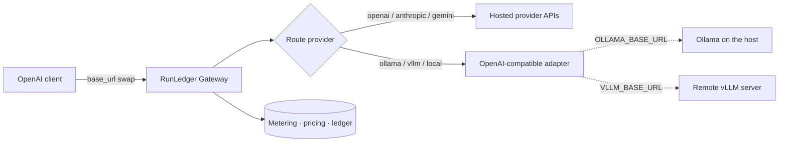

Any OpenAI-compatible endpoint is a first-class gateway provider: **Ollama** (CPU), **vLLM**, or any
local server. RunLedger **points at** the runtime — it doesn't ship it — so you keep full control of
where inference runs, and every local call is metered like a hosted one.

## How it works



Ollama and vLLM both expose an **OpenAI-compatible `/v1/chat/completions`** API, so the gateway routes
them through the same adapter as OpenAI — a route just needs `provider: ollama | vllm | local` and a
`base_url`. From inside a container the Docker host is `http://host.docker.internal:<port>`.

```bash
# .env — external, self-hosted runtimes (not part of the compose suite)
OLLAMA_BASE_URL=http://host.docker.internal:11434/v1   # Ollama on this machine
VLLM_BASE_URL=http://your-vllm-host:8000/v1            # a remote vLLM server
```

## Adding your models

Models come from the pricing catalog. Add a block per model to `config/pricing.yml` (set both rates to
`0.00` for free local inference), then restart the API:

```yaml
- provider: ollama
  model: llama3.1:8b      # the exact name from `ollama list`
  input_per_1m: 0.00
  output_per_1m: 0.00
```

They then appear in the dashboard **model dropdowns** (route creation, and the Context Compiler's
compaction-model picker) and are metered like any hosted provider — so you can compare
cost-per-outcome of a local model against a frontier one on equal footing.

## Where local models are used

- **As a cheap route tier** — send simple requests to a local model, hard ones to a frontier model.
- **As the optimizer's worker model** — the [Context Compiler](/optimization/context-compiler) uses your
  local LLM for conversation compaction and large tool-output summaries, entirely on your infrastructure.

<Note>
The **no-GPU** default holds: Ollama runs fine on CPU. vLLM is used where you already have a GPU host —
RunLedger just needs its URL.
</Note>

See the [overview](/optimization) for the full pipeline.
