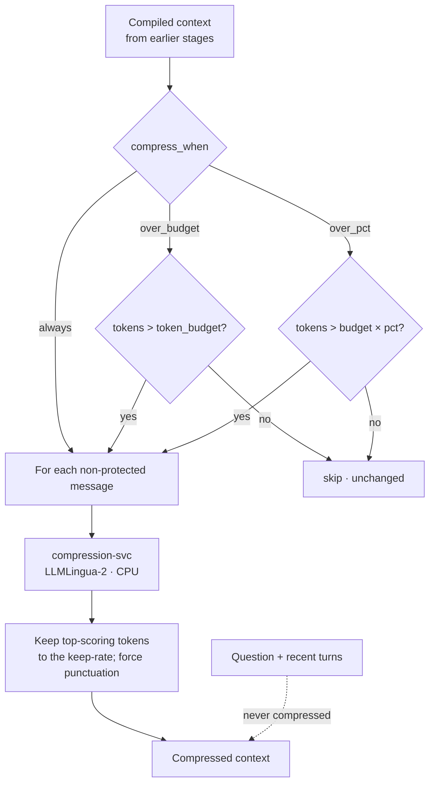

Prompt compression is the most aggressive (lossy) optimization, so it's **opt-in, conservative by
default, and quality-gated**. It uses **LLMLingua-2** (Microsoft, MIT) — a small token-classifier that
scores each token and keeps the most informative ones to hit a target **keep-rate**.

## How it works



LLMLingua-2 runs on **CPU** (no GPU) but — unlike the rest of the optimization layer — needs **PyTorch +
transformers**, so it lives in its own opt-in container. Because it's lossy, it's the one stage that is
**off by default** even when the Context Compiler is enabled.

### Engage policy

Fully configurable via `compress_when`:

| Mode | Runs when… |
|---|---|
| `always` | every request where the stage is on (maximum savings) |
| `over_budget` | the request is still above `token_budget` after the earlier stages (least lossy — a last resort) |
| `over_pct` | tokens exceed `token_budget × compress_budget_pct` (e.g. 80%) |

### Protected spans

The final user question and the most recent turns are **never** compressed — only the bulk middle
context is. Structural tokens (punctuation, newlines) are force-kept so instructions stay intelligible.

## Configuration

Part of the [Context Compiler](/optimization/context-compiler) route config:

```json
{
  "stages": { "compress": true },
  "compression_model": "bert-base-multilingual",  // or "xlm-roberta-large"
  "compression_rate": 0.5,          // fraction of tokens to KEEP (lower = more aggressive)
  "compress_when": "over_budget",   // always | over_budget | over_pct
  "compress_budget_pct": 0.8        // used when compress_when = over_pct
}
```

All of these are editable on the dashboard Gateway page → Context Compiler config popover: a toggle, a
**model dropdown** (extensible registry — more models can be added), a **keep-rate** field, and an
**engage-mode** dropdown with a budget-% field.

<Note>
Compression is measured on the eval harness and can be turned off per route the moment quality regresses.
Start with `over_budget` + `rate 0.5`, then tune toward `over_pct` / lower rates once you've confirmed
quality holds on your workloads.
</Note>

## Models

| Alias | Model | Notes |
|---|---|---|
| `bert-base-multilingual` | `microsoft/llmlingua-2-bert-base-multilingual-cased-meetingbank` | Default — faster on CPU |
| `xlm-roberta-large` | `microsoft/llmlingua-2-xlm-roberta-large-meetingbank` | Higher quality, heavier |

Served by `runledger-compression` (:8209). See
[`examples/35_prompt_compression.py`](https://github.com/avs6/runledger-community/blob/master/examples/35_prompt_compression.py)
and the [overview](/optimization).
