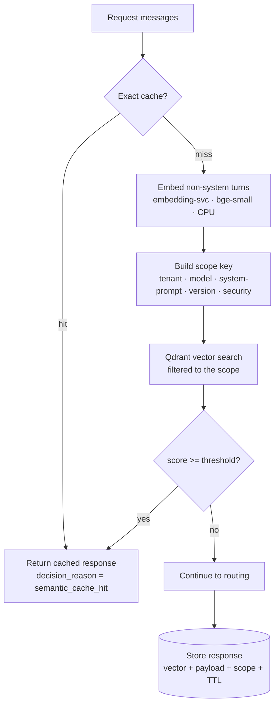

The exact prompt cache only hits on a **byte-for-byte identical** request. The semantic cache also hits
on a **paraphrase** whose embedding is within a similarity threshold — so
`"how much parental leave do employees get"` hits an earlier `"How much parental leave do employees get?"`.

## How it works

1. **Exact cache first.** A SHA-256 of `{model, messages}` is checked; an exact hit returns immediately.
2. **Embed.** On an exact miss (and when enabled), the non-system turns are embedded by `embedding-svc`
   (`BAAI/bge-small-en-v1.5`, 384-dim, ONNX, CPU).
3. **Scope filter.** A **mandatory scope key** — `{tenant, model, system_prompt_hash, knowledge_version,
   security_scope}` — is applied as an exact-match filter in Qdrant. Only vectors in the **same scope** are
   eligible, so a cached answer can never cross a permission or version boundary.
4. **Threshold.** The nearest neighbour must score **≥ the similarity threshold** (default `0.95`) to count
   as a hit; otherwise it's a miss and the request proceeds to routing.
5. **Store.** After a successful provider call the response is stored (vector + payload + scope + TTL) for
   future hits.

<Note>
Scope isolation is a **security property**, not a nicety: identical text under a different `model` (or
tenant, or knowledge version) is a deliberate **miss**. This is what makes shared caching safe in a
multi-tenant deployment.
</Note>

## Enabling it

Any one of:

- **Dashboard** → Gateway page → the **Cache ON/OFF** badge on a route.
- **Per route** → `POST /gateway/routes` with `"semantic_cache_enabled": true`.
- **Per request** → add `"semantic_cache": true` to a `/gateway/chat/completions` body.

The effective switch is *per-request flag **OR** route toggle*. It's **fail-open**: if the cache service
is slow or down, the request proceeds normally.

## Tuning

| Setting | Where | Default | Effect |
|---|---|---|---|
| Similarity threshold | `SEMANTIC_CACHE_THRESHOLD` env / per-request `threshold` | `0.95` | Lower = more hits (looser paraphrases), higher risk of a wrong hit. |
| TTL | `SEMANTIC_CACHE_TTL_SECONDS` | 24h | How long entries stay eligible. |
| Embedding model | `EMBEDDING_MODEL` | `bge-small-en-v1.5` | The shared model of record for all vector surfaces. |

Scores separate cleanly in practice: near-duplicates land ~0.99, related paraphrases ~0.79–0.86, and
unrelated queries ~0.5 — so `0.95` catches near-duplicates and ~0.85 catches rewordings.

## Services

| Service | Port | Role |
|---|---|---|
| `runledger-semantic-cache-svc` | 8205 | Lookup / store, scope enforcement |
| `runledger-embedding-svc` | 8204 | Shared CPU embedding model |
| `runledger-qdrant` | 8202 | Vector store |

See [`examples/33_semantic_cache.py`](https://github.com/avs6/runledger-community/blob/master/examples/33_semantic_cache.py)
for an end-to-end run, and the [overview](/optimization) for where it sits in the pipeline.
