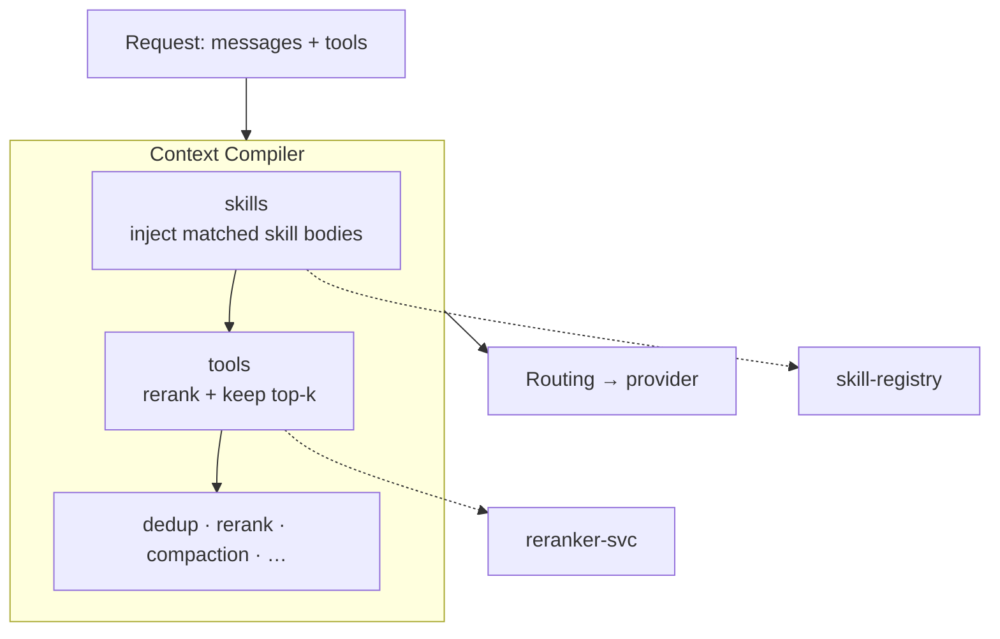

Agents accumulate huge tool catalogs (150+ MCP tools) and reusable skills. Sending all of them on every
call burns tokens. Phase 6 adds two Context Compiler stages that give the model **only what's relevant to
*this* request**: keep the tools that matter, and inject the body of the skills that match.

## How it works



Both stages reuse the **reranker-svc** and **skill-registry** already in the stack — no new services.
Both are **fail-open** and configurable per route.

## Dynamic tool filtering

When a request carries more than a threshold of tools, the compiler reranks each tool's
**name + description** against the current question and keeps the **top-k** most relevant, dropping the
rest. The removed tool schemas' token savings appear in the `token_report`.

- Never drops a configured **`always_tools`** keep-list.
- Only engages above **`tool_filter_threshold`** tools (default 12) — small tool sets pass through.
- Config: `stages.tools`, `tool_k` (default 8), `tool_filter_threshold`, `tool_min_score`, `always_tools`.

Also available as an **MCP tool** — `select_tools(query, tools)` — so an MCP client can pre-filter a big
catalog before a call.

## Skill injection (inject-body-on-match)

Recalls the workspace's skills from the [skill registry](/optimization/cognitive-layer), reranks their
descriptions against the question, and for skills scoring above `skill_min_score` injects the **full skill
body** (capped at `skill_k`, default 2) as a compact system block. Provider-agnostic — works for any model
through the gateway.

- Config: `stages.skills` (opt-in, default off), `skill_k`, `skill_min_score`.
- Scoped by workspace.

<Note>
Only **procedural knowledge** (the `SKILL.md` body) is injected. **Executable / resource skills** stay
agent/directory-scoped — the gateway injects instructions, it doesn't run scripts — and remain served via
the MCP `skill_list` / `skill_get` tools.
</Note>

## Configuration

Part of the [Context Compiler](/optimization/context-compiler) route config:

```json
{
  "stages": { "tools": true, "skills": false },
  "tool_k": 8,
  "tool_filter_threshold": 12,
  "always_tools": [],
  "skill_k": 2,
  "skill_min_score": -8.0
}
```

Editable on the dashboard Gateway page → Context Compiler config popover (Tool filtering + Skill injection
toggles). See [`examples/38_tool_filtering_skills.py`](https://github.com/avs6/runledger-community/blob/master/examples/38_tool_filtering_skills.py)
and the [overview](/optimization).
