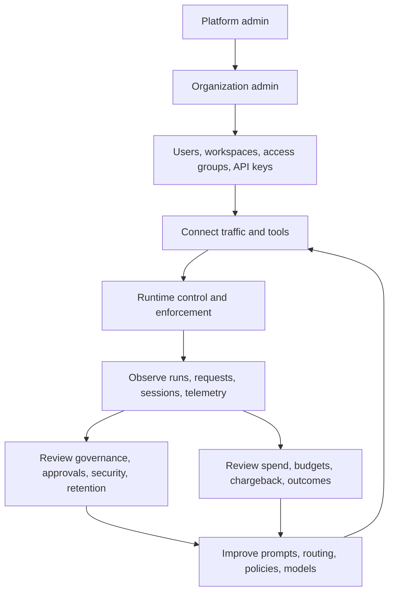
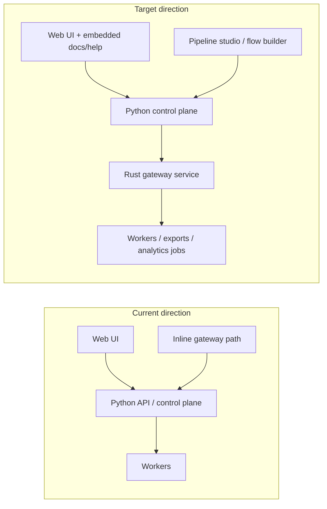

RunLedger works best when users understand it as one connected operating model rather than a pile of separate admin pages.

At a high level, the product is used in this order:

1. A platform admin deploys and configures the core control plane.
2. An organization admin creates an organization, users, workspaces, access groups, and API keys.
3. Builders connect apps, agents, SDKs, MCP clients, gateway traffic, or OTLP telemetry.
4. Runtime policy, routing, caching, and budget enforcement shape live traffic.
5. Operators investigate runs, requests, sessions, quality, governance, and cost.
6. Teams improve prompts, routes, models, budgets, and workflows over time.

## Hierarchical usage model

## Product domains

### 1. Platform and access foundation

This is the administrative base layer:

- platform deployment and settings
- organizations
- users and workspace membership
- access groups
- API keys
- onboarding and setup guidance

Without this layer, the rest of the suite becomes disconnected or hard to govern.

### 2. Ingest and connectivity

This is how traffic enters RunLedger:

- Python SDK
- TypeScript SDK
- Gateway
- OTLP / OpenInference
- MCP
- webhook-based ingestion

Each path should eventually normalize into the same control-plane model.

### 3. Runtime control

This is where live decisions happen:

- provider profiles
- routing
- fallback
- caching
- runtime guardrails
- budgets and rate-oriented enforcement

This is also the area most likely to benefit from a future dedicated high-performance gateway service.

### 4. Observability and investigation

This is where operators understand what happened:

- dashboards
- runs
- sessions
- request flow
- request explorer
- telemetry
- engineering and model-usage views

### 5. Governance and safety

This is where teams decide what should be allowed:

- prompts
- evaluations
- approvals
- tool policies
- audit evidence
- data capture
- security
- retention

### 6. FinOps and business accountability

This is where spend becomes accountable:

- metering
- pricing
- budgets
- chargeback
- billing
- outcomes and ROI
- ledger and compliance evidence

### 7. Build and improve

This is the closed-loop improvement layer:

- playground
- workflows
- agents
- replay
- optimization opportunities
- optimization simulator
- model scorecards

## Current architecture vs target direction

Today, RunLedger combines a Python control plane with an optional inline gateway path and a growing set of operator surfaces.

The target direction adds a clearer split:

- **control plane**: Python-heavy management, analytics, governance, and documentation surfaces
- **data plane**: high-performance gateway/runtime enforcement, potentially as a dedicated Rust service
- **flow studio**: a future visual builder for execution pipelines and policy-aware branching

## Recommended way to navigate the docs

Use the docs in the same order most customers use the product:

1. **Getting Started**
2. **Platform Overview**
3. **Administration & Access**
4. **Ingest & Connectivity**
5. **Gateway & Routing**
6. **Observability**
7. **Governance & Safety**
8. **FinOps**
9. **Build & Improve**
10. **Operations & Self-Hosting**

That structure keeps the docs aligned with the actual product lifecycle instead of repository history.
